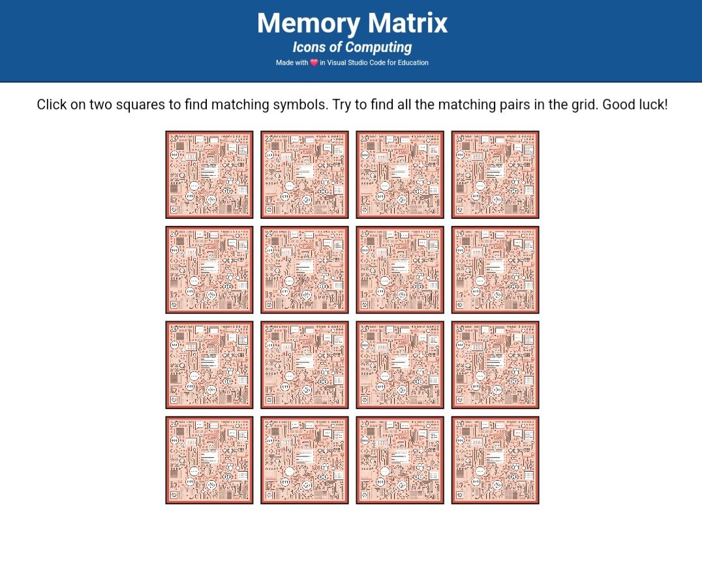

# Memory Matrix: Icons of Computing

A fun and educational memory matching game featuring computing-themed icons. Players must find matching pairs of cards while racing against time, testing both their memory and quick thinking skills.

*Memory Matrix game board showing computing-themed cards*

## Features

- 8 unique computing-themed pairs (16 cards total)
- Interactive card-flipping mechanics
- Timer to track gameplay duration
- Match counter to show progress
- Confetti celebration animation on victory
- Responsive design that works on both desktop and mobile devices
- Accessible design with ARIA labels
- "Play Again" functionality for multiple rounds

## Game Icons

The game includes the following themed icons:
- Graduation Cap (Education)
- Computer Chip (Hardware)
- Gears (Systems)
- Keyboard (Input Devices)
- Rocket (Launch/Deployment)
- Satellite (Communications)
- Bug (Debugging)
- Logic Gates (Programming)

## How to Play

1. Click or tap on any card to reveal its icon
2. Click or tap another card to find its match
3. If the cards match, they'll stay face up
4. If they don't match, both cards will flip face down
5. Continue until all pairs are matched
6. Try to complete the game in the shortest time possible!

## Technical Details

- Built with HTML, CSS, and JavaScript
- No external libraries or frameworks required
- Responsive design using CSS Grid

## Accessibility

The game includes several accessibility features:
- ARIA labels for important game elements
- Semantic HTML structure
- Keyboard navigation support
- Clear visual feedback for card states

## Credits

- Icons provided by [VS Code for Education](https://vscodeedu.com/)
- Made with Visual Studio Code for Education

🎮 [Play Live )(https://amankumar0098.github.io/Memory-Matrix-Game/)
